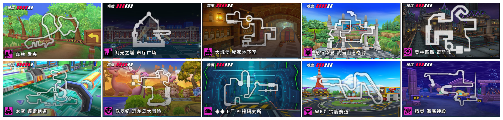

# 图池生成器（Map Pool Generator）

一款用于生成《跑跑卡丁车》赛事地图图池的网页工具，支持地图搜索、图池管理与图片导出等功能。

由｜南山居客｜车队西瓜卡开发。

---

## ✨ 功能特点

- 🖼️ 图池构建：点击地图即可加入，最多可设置上限
- 🔍 搜索功能：支持地图中文名与拼音模糊搜索
- 🌗 昼夜模式：一键切换白天 / 夜间界面风格
- 🧩 图池导出：将图池内容导出为整图 PNG
- 🧹 操作简便：支持删除选中项、一键清空
- 💡 高亮选中：选中地图有视觉高亮提示

---

## 🚀 使用方法

访问指定域名（待开发）

## 📃 文件结构

```plain-text
map-pool-generator/
├── public/
├── src/
│   ├── components/
│   │   ├── MapCard.jsx
│   │   └── MapSearchBar.jsx
│   ├── data/
│   │   └── maps.json
│   └── App.jsx
├── index.html
├── tailwind.config.js
├── postcss.config.js
├── vite.config.js
└── README.md
```

## 🖼️ 示例截图


## 🧑‍💻 开发者信息

本项目由「南山居客｜车队西瓜卡」独立开发。
如有问题欢迎提交 Issue 或 Fork 项目扩展。

## 📄 License

MIT License